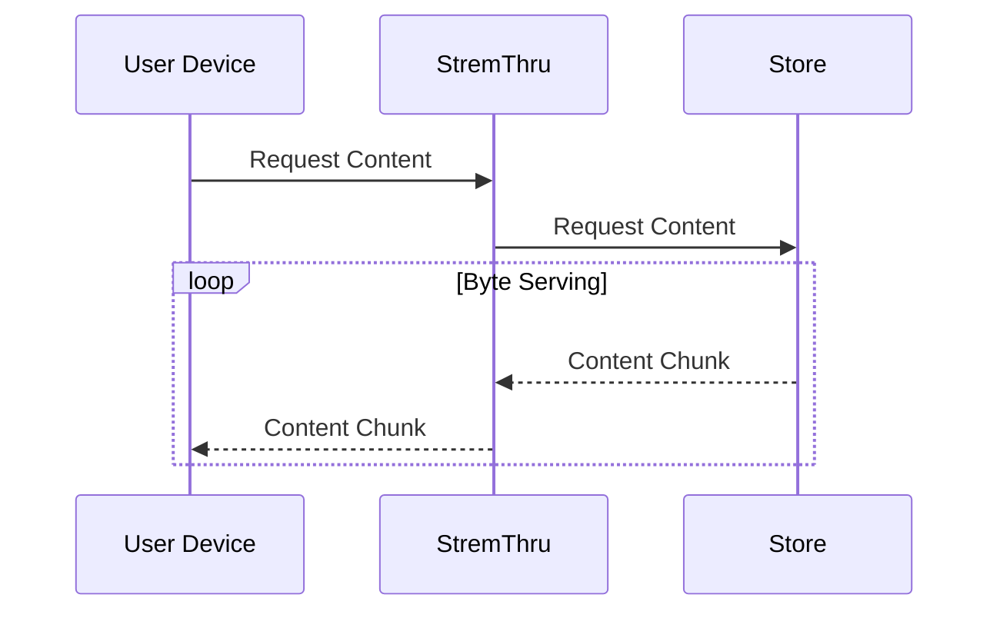
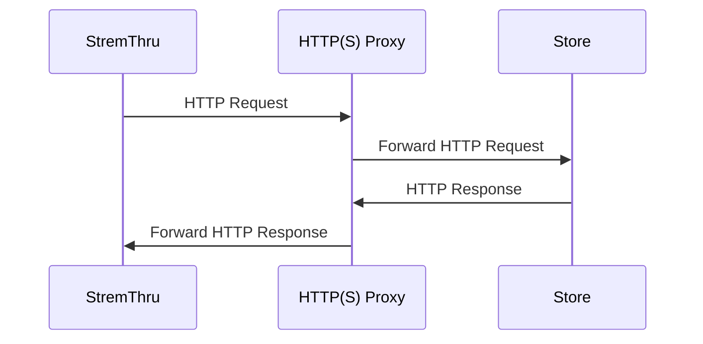

[](https://github.com/MunifTanjim/stremthru/actions/workflows/ci.yml)
[](https://github.com/MunifTanjim/stremthru/blob/master/LICENSE)

# StremThru

Companion for Stremio.

## Features

- HTTP(S) Proxy
- Proxy Authorization
- [Byte Serving](https://en.wikipedia.org/wiki/Byte_serving)

### Store Integration

- [AllDebrid](https://alldebrid.com)
- [Debrid-Link](https://debrid-link.com)
- [EasyDebrid](https://easydebrid.com)
- [Offcloud](https://offcloud.com)
- [PikPak](https://mypikpak.com)
- [Premiumize](https://www.premiumize.me)
- [RealDebrid](https://real-debrid.com)
- [TorBox](https://torbox.app)

### SDK

- [JavaScript](./sdk/js)
- [Python](./sdk/py)

### Concepts

#### Store

_Store_ is an external service that provides access to content. StremThru acts as an interface for the _store_.

#### Store Content Proxy

StremThru can proxy the content from the _store_. For proxy authorized requests, this is enabled by default.



#### Store Tunnel

If you can't access the _store_ using your IP, you can use HTTP(S) Proxy to tunnel the traffic to the _store_.



## Configuration

Configuration is done using environment variables.

#### `STREMTHRU_PORT`

Port to listen on, default `8080`.

#### `STREMTHRU_LOG_LEVEL`

Log level.

| Log Level          |
| ------------------ |
| `DEBUG`            |
| `INFO` _(default)_ |
| `WARN`             |
| `ERROR`            |

#### `STREMTHRU_LOG_FORMAT`

Log format.

| Log Level          |
| ------------------ |
| `json` _(default)_ |
| `text`             |

#### `STREMTHRU_DATA_DIR`

Data directory.

#### `STREMTHRU_HTTP_PROXY`

HTTP Proxy URL.

#### `STREMTHRU_TUNNEL`

> [!WARNING]
> Can not override `STREMTHRU_STORE_TUNNEL`.

Comma separated list of tunnel config, in `hostname:tunnel_config` format.

| `tunnel_config` | Description                        |
| --------------- | ---------------------------------- |
| `true`          | Enable with `STREMTHRU_HTTP_PROXY` |
| `false`         | Disable                            |

If `hostname` is `*`, and `tunnel_config` is `false`, only explicitly enabled hostnames
will be tunneled.

#### `STREMTHRU_PROXY_AUTH`

Comma separated list of credentials, in the following formats:

- plain text credentials, e.g. `username:password`
- or base64 encoded credentials, e.g. `dXNlcm5hbWU6cGFzc3dvcmQ=`

These will be used for proxy authorization.

#### `STREMTHRU_AUTH_ADMIN`

Comma separated list of admin usernames.

#### `STREMTHRU_STORE_AUTH`

Comma separated list of store credentials, in `username:store_name:store_token` format.

For proxy-authorized requests, these credentials will be used.

If `username` is `*`, it is used as fallback for users without explicit store credentials.

| Store       | `store_name` | `store_token`        |
| ----------- | ------------ | -------------------- |
| AllDebrid   | `alldebrid`  | `<api-key>`          |
| Debrid-Link | `debridlink` | `<api-key>`          |
| EasyDebrid  | `easydebrid` | `<api-key>`          |
| Offcloud    | `offcloud`   | `<email>:<password>` |
| PikPak      | `pikpak`     | `<email>:<password>` |
| Premiumize  | `premiumize` | `<api-key>`          |
| RealDebrid  | `realdebrid` | `<api-token>`        |
| Torbox      | `torbox`     | `<api-key>`          |

#### `STREMTHRU_STORE_TUNNEL`

> [!WARNING]
> Only used when using StremThru to interact with the Store. Not affected by `STREMTHRU_TUNNEL`.
> StremThru will _**try**_ to automatically adjust `STREMTHRU_TUNNEL` to reflect `STREMTHRU_STORE_TUNNEL`.

Comma separated list of tunnel config for stores, in `store_name:tunnel_config` format.

| `tunnel_config` | Description         |
| --------------- | ------------------- |
| `true`          | Enable              |
| `false`         | Disable             |
| `api`           | Enable for API only |

If `store_name` is `*`, it is used as fallback.

When enabled, `STREMTHRU_HTTP_PROXY` will be used to tunnel traffic for the store.

#### `STREMTHRU_STORE_CONTENT_PROXY`

Comma separated list of store content proxy config, in `store_name:content_proxy_config` format.

| `content_proxy_config` | Description |
| ---------------------- | ----------- |
| `true`                 | Enable      |
| `false`                | Disable     |

If `store_name` is `*`, it is used as fallback.

When enabled, StremThru will proxy the content from the store.

#### `STREMTHRU_CONTENT_PROXY_CONNECTION_LIMIT`

Comma separated list of content proxy connection limit per user, in `username:connection_limit` format.

If `username` is `*`, it is used as fallback.

If `connection_limit` is `0`, no connection limit is applied.

#### `STREMTHRU_STORE_CONTENT_CACHED_STALE_TIME`

Comma separated list of stale time for cached/uncached content in store, in `store_name:cached_stale_time:uncached_stale_time` format.
e.g. `*:24h:8h`.

If `store_name` is `*`, it is used as fallback.

#### `STREMTHRU_PEER_URI`

URI for peer StremThru instance, in format `https://:<pass>@<host>[:<port>]`.

#### `STREMTHRU_REDIS_URI`

URI for Redis, in format `redis://<user>:<pass>@<host>[:<port>][/<db>]`.

If provided, it'll be used for caching instead of in-memory storage.

#### `STREMTHRU_DATABASE_URI`

URI for Database, in format `<scheme>://<user>:<pass>@<host>[:<port>][/<db>]`.

Supports `sqlite` and `postgresql`.

#### `STREMTHRU_FEATURE`

Comma separated list of features to enable/disable.

## Endpoints

### Authentication

**`X-StremThru-Authorization` Header**

Basic auth header, e.g. `Basic dXNlcm5hbWU6cGFzc3dvcmQ=`

`X-StremThru-Authorization` header is checked against `STREMTHRU_PROXY_AUTH` config.

### Proxy

#### Proxify Links

Authorization is checked against `STREMTHRU_PROXY_AUTH` config.

If `token` query parameter is present, the proxified link will not be encrypted.
e.g. `dXNlcm5hbWU6cGFzc3dvcmQ=`

Otherwise, if `X-StremThru-Authorization` header is present, the proxified link will be encrypted.
e.g. `Basic dXNlcm5hbWU6cGFzc3dvcmQ=`

**`GET /v0/proxy`**

**Query Parameters**:

- `url`: URL to proxify _(multiple)_
- `exp`: Expiration time duration _(optional)_
- `req_headers[i]`: Headers to add to the request for `url` at position `i` _(optional)_
- `req_headers`: Fallback headers if `req_headers[i]` is missing _(optional)_
- `filename[i]`: Filename for the `url` at position `i` _(optional)_
- `token`: Token to use for authorization _(optional)_
- `redirect`: Redirect to proxified url, valid for single `url` _(optional)_

**`POST /v0/proxy`**

**Request**:

`x-www-form-urlencoded` body with the following fields:

- `url`: URL to proxify _(multiple)_
- `exp`: Expiration time duration _(optional)_
- `req_headers[i]`: Headers to add to the request for `url` at position `i` _(optional)_
- `req_headers`: Fallback headers if `req_headers[i]` is missing _(optional)_
- `filename[i]`: Filename for the `url` at position `i` _(optional)_
- `token`: Token to use for authorization _(optional)_

**Response**:

```json
{
  "items": ["string"],
  "total_items": "int"
}
```

### Store

This is a common interface for interacting with external stores.

If `X-StremThru-Store-Name` header is present, the value is used as store name. Otherwise,
the first store configured for the user using `STREMTHRU_STORE_AUTH` config is used.

**Authentication**

If `STREMTHRU_STORE_AUTH` is configured, then proxy-authorized requests will be
automatically authenticated for external stores.

For non-proxy-authorized requests, the following HTTP headers are used:

- `X-StremThru-Store-Authorization`
- `Authorization`

Values for these headers will be forwarded to the external store.

#### Get User

**`GET /v0/store/user`**

Get information about authenticated user.

**Response**:

```json
{
  "data": {
    "id": "string",
    "email": "string",
    "subscription_status": "UserSubscriptionStatus"
  }
}
```

#### Add Magnet

**`POST /v0/store/magnets`**

Add magnet link for download.

**Request**:

```json
{
  "magnet": "string"
}
```

**Response**:

```json
{
  "data": {
    "id": "string",
    "hash": "string",
    "magnet": "string",
    "name": "string",
    "size": "int",
    "status": "MagnetStatus",
    "files": [
      {
        "index": "int",
        "link": "string",
        "name": "string",
        "path": "string",
        "size": "int"
      }
    ],
    "added_at": "datetime"
  }
}
```

If `.status` is `downloaded`, `.files` will have the list of files.

#### List Magnets

**`GET /v0/store/magnets`**

List magnets on user's account.

**Query Parameter**:

- `limit`: min `1`, max `500`, default `100`
- `offset`: min `0`, default `0`

**Response**:

```json
{
  "data": {
    "items": [
      {
        "id": "string",
        "hash": "string",
        "name": "string",
        "size": "int",
        "status": "MagnetStatus",
        "added_at": "datetime"
      }
    ],
    "total_items": "int"
  }
}
```

#### Get Magnet

**`GET /v0/store/magnets/{magnetId}`**

Get magnet on user's account.

**Path Parameter**:

- `magnetId`: magnet id

**Response**:

```json
{
  "data": {
    "id": "string",
    "hash": "string",
    "name": "string",
    "size": "int",
    "status": "MagnetStatus",
    "files": [
      {
        "index": "int",
        "link": "string",
        "name": "string",
        "path": "string",
        "size": "int"
      }
    ],
    "added_at": "datetime"
  }
}
```

#### Remove Magnet

**`DELETE /v0/store/magnets/{magnetId}`**

Remove magnet from user's account.

**Path Parameter**:

- `magnetId`: magnet id

#### Check Magnet

**`GET /v0/store/magnets/check`**

Check magnet links.

**Query Parameter**:

- `magnet`: comma seperated magnet links (min `1`, max `500`)
- `sid`: stremio stream id

**Response**:

```json
{
  "data": {
    "items": [
      {
        "hash": "string",
        "magnet": "string",
        "status": "MagnetStatus",
        "files": [
          {
            "index": "int",
            "name": "string",
            "size": "int"
          }
        ]
      }
    ]
  }
}
```

If `.status` is `cached`, `.files` will have the list of files.

> [!NOTE]
> For `offcloud`, the `.files` list is always empty.

If `.files[].index` is `-1`, the index of the file is unknown and you should rely on `.name` instead.

If `.files[].size` is `-1`, the size of the file is unknown.

#### Generate Link

`POST /v0/store/link/generate`

Generate direct link for a file link.

**Request**:

```json
{
  "link": "string"
}
```

**Response**:

```json
{
  "data": {
    "link": "string"
  }
}
```

> [!NOTE]
> The generated direct link should be valid for 12 hours.

### Stremio Addon

#### Store

`/stremio/store`

Explore and Search Store Catalog.

#### Wrap

`/stremio/wrap`

Stremio Addon to Wrap other Addons with StremThru.

#### Sidekick

`/stremio/sidekick`

Extra Features for Stremio.

### Enums

#### MagnetStatus

- `cached`
- `queued`
- `downloading`
- `processing`
- `downloaded`
- `uploading`
- `failed`
- `invalid`
- `unknown`

#### UserSubscriptionStatus

- `expired`
- `premium`
- `trial`

## Usage

**Source**

```sh
git clone https://github.com/MunifTanjim/stremthru
cd stremthru

# configure
export STREMTHRU_PROXY_AUTH=username:password

# run
make run

# build and run
make build
./stremthru
```

**Docker**

```sh
docker run --name stremthru -p 8080:8080 \
  -e STREMTHRU_PROXY_AUTH=username:password \
  muniftanjim/stremthru
```

**Docker Compose**

```sh
cp compose.example.yaml compose.yaml

docker compose up stremthru
```

## Related Resources

Cloudflare WARP:

- [github.com/cmj2002/warp-docker](https://github.com/cmj2002/warp-docker)

## License

Licensed under the MIT License. Check the [LICENSE](./LICENSE) file for details.
